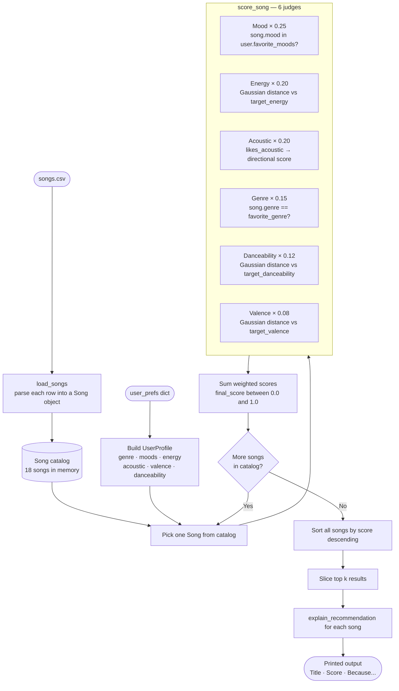

# 🎵 Music Recommender Simulation

## Project Summary

In this project you will build and explain a small music recommender system.

Your goal is to:

- Represent songs and a user "taste profile" as data
- Design a scoring rule that turns that data into recommendations
- Evaluate what your system gets right and wrong
- Reflect on how this mirrors real world AI recommenders

Replace this paragraph with your own summary of what your version does.

---

## How The System Works

Real-world recommenders like Spotify and YouTube build a model of your taste from everything you do — skips, replays, likes, time of day — and use that signal to surface content you haven't heard yet. Most production systems combine two approaches: collaborative filtering (finding users who behave like you and borrowing their taste) and content-based filtering (matching song attributes directly to your preferences). This simulation focuses on the content-based side. Rather than tracking user behavior over time, it takes a snapshot of what a user says they want — their preferred genre, mood, energy level, and whether they lean acoustic — and scores every song in the catalog against that profile. The goal is to surface the most relevant match, not just the most popular song. Each feature is weighted differently based on how much it actually distinguishes songs from one another, so mood and energy carry more influence than valence, which has a narrower range across the catalog.

### Song Features

Each `Song` object stores the following attributes used in scoring:

| Feature | Type | Role in scoring |
|---|---|---|
| `genre` | string | Categorical match against user's preferred genre |
| `mood` | string | Matched against user's list of preferred moods |
| `energy` | float (0–1) | Gaussian proximity to user's target energy level |
| `tempo_bpm` | float | Stored on the song; not directly scored (correlated with energy) |
| `valence` | float (0–1) | Gaussian proximity to user's target valence |
| `danceability` | float (0–1) | Gaussian proximity to user's target danceability |
| `acousticness` | float (0–1) | Directional score based on whether user prefers acoustic or not |

### UserProfile Fields

Each `UserProfile` stores what the user wants:

| Field | Type | Maps to |
|---|---|---|
| `favorite_genre` | string | Matched against `song.genre` |
| `favorite_moods` | List[str] | Matched against `song.mood` — any match scores 1.0 |
| `target_energy` | float (0–1) | Gaussian proximity against `song.energy` |
| `likes_acoustic` | bool | If True, rewards high `acousticness`; if False, rewards low |
| `target_valence` | float (0–1) | Gaussian proximity against `song.valence` |
| `target_danceability` | float (0–1) | Gaussian proximity against `song.danceability` |

### Scoring and Ranking

Each song receives a weighted score between 0 and 1:

- **Categorical features** (mood, genre) use binary matching: 1.0 for a match, 0.0 otherwise
- **Numeric features** (energy) use Gaussian proximity: songs closer to the user's target score higher, with a smooth dropoff the further they are
- **Directional features** (acousticness) score based on alignment with a boolean preference rather than proximity to a target value

Feature weights reflect how much each feature distinguishes songs in the catalog:

```
score = 0.25 × mood_match + 0.20 × energy_proximity + 0.20 × acoustic_alignment + 0.15 × genre_match + 0.12 × danceability_proximity + 0.08 × valence_proximity
```

Songs are ranked by score descending and the top `k` are returned.

---

### Algorithm Recipe

This is the step-by-step process the system follows every time it runs:

1. **Load the catalog** — Read `songs.csv` and parse every row into a `Song` object. All 18 songs are held in memory.
2. **Read the user profile** — Pull genre, moods, target energy, acoustic preference, target valence, and target danceability from `user_prefs`.
3. **Score every song** — For each song, run it through 6 independent judges and sum their weighted outputs:
   - **Mood (×0.25):** Is `song.mood` in the user's mood list? → `1.0` or `0.0`
   - **Energy (×0.20):** Gaussian proximity between `song.energy` and `target_energy` — perfect match = 1.0, drops off smoothly with distance
   - **Acousticness (×0.20):** If `likes_acoustic=True` → reward `song.acousticness`; if `False` → reward `1 − song.acousticness`
   - **Genre (×0.15):** Does `song.genre` match `favorite_genre`? → `1.0` or `0.0`
   - **Danceability (×0.12):** Gaussian proximity between `song.danceability` and `target_danceability`
   - **Valence (×0.08):** Gaussian proximity between `song.valence` and `target_valence`
4. **Rank** — Sort all scored songs from highest to lowest score.
5. **Slice** — Return the top `k` songs (default 5).
6. **Explain** — For each result, generate a human-readable string reporting which judges fired and what the key scores were.

The Gaussian proximity formula used for numeric features:

```
gaussian(song_val, target) = exp( -((song_val - target)² / (2 × σ²)) )   where σ = 0.2
```

---

### System Flowchart

The diagram below shows how a single song moves from the CSV file to the final ranked output:



---

### Known Biases and Limitations

- **Mood dominance:** With a weight of 0.25, mood is the single strongest signal. A rock song that matches the user's mood will outscore a hip-hop song that only matches genre — even if the user strongly prefers hip-hop. This is intentional but worth knowing.
- **Genre is a hard filter at low weight:** Genre uses binary matching (1.0 or 0.0) but carries only 0.15 weight. A song in a different genre can still score well on all other features and appear in the top 5. This creates cross-genre recommendations that may feel unexpected.
- **No catalog diversity enforcement:** The system can return 5 songs by the same artist or in the same genre if they all score highly. There is no diversity injection.
- **Acoustic preference is one-directional:** `likes_acoustic` is a boolean, not a target value. A user who wants a *slightly* acoustic sound gets the same scoring function as one who wants *fully* acoustic.
- **Small catalog amplifies bias:** With only 18 songs, a missing mood-genre combination (e.g., no hip-hop song with mood "intense") means the top result may not actually match what the user wants — even with a perfect profile.

---

## Getting Started

### Setup

1. Create a virtual environment (optional but recommended):

   ```bash
   python -m venv .venv
   source .venv/bin/activate      # Mac or Linux
   .venv\Scripts\activate         # Windows

2. Install dependencies

```bash
pip install -r requirements.txt
```

3. Run the app:

```bash
python -m src.main
```

### Running Tests

Run the starter tests with:

```bash
pytest
```

You can add more tests in `tests/test_recommender.py`.

---

## Experiments You Tried

Use this section to document the experiments you ran. For example:

- What happened when you changed the weight on genre from 2.0 to 0.5
- What happened when you added tempo or valence to the score
- How did your system behave for different types of users

---

## Limitations and Risks

Summarize some limitations of your recommender.

Examples:

- It only works on a tiny catalog
- It does not understand lyrics or language
- It might over favor one genre or mood

You will go deeper on this in your model card.

---

## Reflection

Read and complete `model_card.md`:

[**Model Card**](model_card.md)

Write 1 to 2 paragraphs here about what you learned:

- about how recommenders turn data into predictions
- about where bias or unfairness could show up in systems like this


---

## 7. `model_card_template.md`

Combines reflection and model card framing from the Module 3 guidance. :contentReference[oaicite:2]{index=2}  

```markdown
# 🎧 Model Card - Music Recommender Simulation

## 1. Model Name

Give your recommender a name, for example:

> VibeFinder 1.0

---

## 2. Intended Use

- What is this system trying to do
- Who is it for

Example:

> This model suggests 3 to 5 songs from a small catalog based on a user's preferred genre, mood, and energy level. It is for classroom exploration only, not for real users.

---

## 3. How It Works (Short Explanation)

Describe your scoring logic in plain language.

- What features of each song does it consider
- What information about the user does it use
- How does it turn those into a number

Try to avoid code in this section, treat it like an explanation to a non programmer.

---

## 4. Data

Describe your dataset.

- How many songs are in `data/songs.csv`
- Did you add or remove any songs
- What kinds of genres or moods are represented
- Whose taste does this data mostly reflect

---

## 5. Strengths

Where does your recommender work well

You can think about:
- Situations where the top results "felt right"
- Particular user profiles it served well
- Simplicity or transparency benefits

---

## 6. Limitations and Bias

Where does your recommender struggle

Some prompts:
- Does it ignore some genres or moods
- Does it treat all users as if they have the same taste shape
- Is it biased toward high energy or one genre by default
- How could this be unfair if used in a real product

---

## 7. Evaluation

How did you check your system

Examples:
- You tried multiple user profiles and wrote down whether the results matched your expectations
- You compared your simulation to what a real app like Spotify or YouTube tends to recommend
- You wrote tests for your scoring logic

You do not need a numeric metric, but if you used one, explain what it measures.

---

## 8. Future Work

If you had more time, how would you improve this recommender

Examples:

- Add support for multiple users and "group vibe" recommendations
- Balance diversity of songs instead of always picking the closest match
- Use more features, like tempo ranges or lyric themes

---

## 9. Personal Reflection

A few sentences about what you learned:

- What surprised you about how your system behaved
- How did building this change how you think about real music recommenders
- Where do you think human judgment still matters, even if the model seems "smart"

